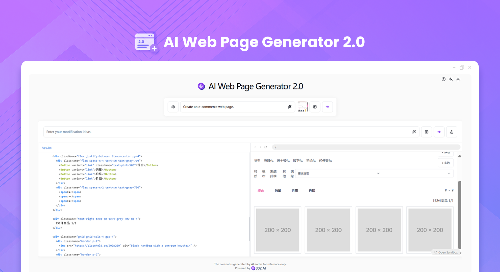
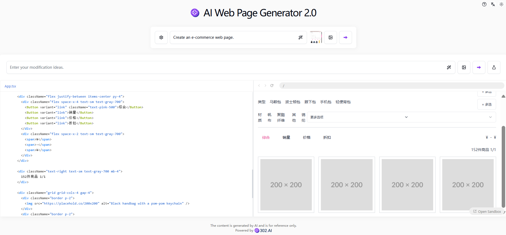

# 
💻 AI Web Page Generator 2.0 🚀✨

The AI Web Page Generator 2.0 can generate high-quality front-end HTML files through the AI large model by simply using natural language to describe the content of the web page. It supports the use of shadcn/ui.

<a href="README_zh.md">中文</a> | <a href="README.md">English</a> | <a href="README_ja.md">日本語</a>

Open-source version of the [AI Web Page Generator 2.0](https://302.ai/product/detail/40) from [302.AI](https://302.ai/en/).
You can directly log in to 302.AI for a zero-code, zero-configuration online experience.
Alternatively, customize this project to suit your needs, integrate 302.AI's API KEY, and deploy it yourself.

## Interface Preview
Generate web pages according to users' needs. The left column shows the code of the web page, and the right column shows the preview image of the web page.

## Project Features
### 🤖 Intelligent Code Generation
Automatically generate code according to your needs.
### ✍️ Flexible Editing
You can adjust and modify the code content at any time during the generation process.
### 🎨 Flexible UI Selection
It supports the shadcn/ui component library to quickly create an aesthetically pleasing interface.
### 🌟 3D Visualization
It supports three.js, enabling you to easily achieve 3D visualization functions.
### 🛠️ Prompt Optimization
Optimize the prompts to make the content generated by AI more accurate.
### 🖼️ Image Assistance
It supports uploading design drawings and allows AI to generate corresponding code based on the images.
### 💬 Multi-round Interaction
It supports continuous conversations and continuously adjusts code generation according to feedback.
### 🔗 Code Reference
You can reference the generated code snippets and ask AI to make corresponding modifications.
### 📤Convenient Sharing
Easily share the generated code so that more people can appreciate your work.
### 🌙 Eye-friendly Dark Mode
Provide a dark mode to take care of your eye health.
### 🌍 Multi-language Support
- Chinese Interface
- English Interface
- Japanese Interface

With AI Code Generator 2.0, anyone can become a code creator! 🎉💻 Let's explore the world of AI-driven code together! 🌟🚀

## 🚩 Future Update Plans 
- [ ] The simplicity of the code is improved
- [ ] The expansion of diverse templates
- [ ] The newly added function of generating dynamic content

## Tech Stack
- Next.js 14
- Tailwind CSS
- Shadcn UI
- Sandpack
- Vecel AI SDK

## Development & Deployment
1. Clone the project `git clone https://github.com/302ai/302_coder_generator`
2. Install dependencies `pnpm install`
3. Configure 302's API KEY as per .env.example
4. Run the project `pnpm dev`
5. Build and deploy `docker build -t coder-generator . && docker run -p 3000:3000 coder-generator`

## ✨ About 302.AI ✨
[302.AI](https://302.ai) is an enterprise-oriented AI application platform that offers pay-as-you-go services, ready-to-use solutions, and an open-source ecosystem.✨
1. 🧠 Comprehensive AI capabilities: Incorporates the latest in language, image, audio, and video models from leading AI brands.
2. 🚀 Advanced application development: We build genuine AI products, not just simple chatbots.
3. 💰 No monthly fees: All features are pay-per-use, fully accessible, ensuring low entry barriers with high potential.
4. 🛠 Powerful admin dashboard: Designed for teams and SMEs - managed by one, used by many.
5. 🔗 API access for all AI features: All tools are open-source and customizable (in progress).
6. 💡 Powerful development team: Launching 2-3 new applications weekly with daily product updates. Interested developers are welcome to contact us.
