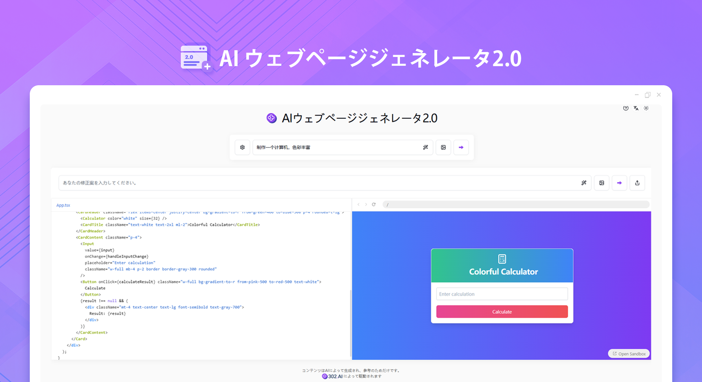
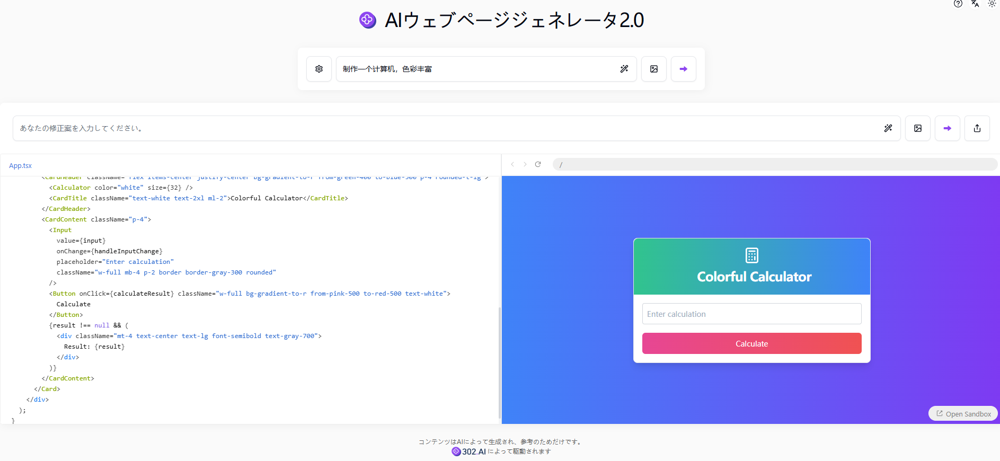

# 
💻 AIウェブページジェネレーター2.0🚀✨

AI ウェブページ生成器 2.0 は、自然言語でウェブページの内容を記述するだけで、AI 大規模モデルを通じて高品質なフロントエンド HTML ファイルを生成できます。shadcn/ui の使用をサポートしています。

<a href="README_zh.md">中文</a> | <a href="README.md">English</a> | <a href="README_ja.md">日本語</a>

[302.AI](https://302.ai)の[AIウェブページジェネレーター2.0](https://302.ai/ja/tools/coder/)のオープンソース版です。
302.AIに直接ログインすることで、コード不要、設定不要のオンライン体験が可能です。
あるいは、このプロジェクトをニーズに合わせてカスタマイズし、302.AIのAPI KEYを統合して、自身でデプロイすることもできます。

## インターフェースプレビュー
ユーザーのニーズに応じてウェブページを生成します。左の欄にはウェブページのコードが表示され、右の欄にはウェブページのプレビュー画像が表示されます。

## プロジェクトの特徴
### 🤖 知的コード生成
あなたのニーズに応じて自動的にコードを生成します。
### ✍️ 柔軟な編集
生成プロセス中にいつでもコード内容を調整および修正できます。
### 🎨 UI の柔軟な選択
shadcn/ui コンポーネントライブラリをサポートし、素敵なインターフェースをすばやく作成できます。
### 🌟 3D 可視化
three.js をサポートし、簡単に 3D 可視化機能を実現できます。
### 🛠️ プロンプトの最適化
プロンプトを最適化し、AI が生成する内容をより正確にします。
### 🖼️ 画像支援
デザイン図をアップロードすることをサポートし、AI に画像に基づいて対応するコードを生成させます。
### 💬 マルチラウンド相互作用
継続的な会話をサポートし、フィードバックに応じてコード生成を継続的に調整します。
### 🔗 コード参照
生成されたコードスニペットを参照し、AI に対応する修正を行わせることができます。
### 📤 便利な共有
生成されたコードを簡単に共有し、より多くの人にあなたの作品を鑑賞させます。
### 🌙 配慮のあるダークモード
ダークモードを提供し、あなたの目の健康を守ります。
### 🌍 多言語サポート
- 中国語インターフェース
- 英語インターフェース
- 日本語インターフェース

AIコードジェネレーター2.0を使用すると、誰でもコードクリエーターになれます！🎉💻 AIが駆動するコード生成の新しい世界を一緒に探索しましょう！🌟🚀

## 🚩 将来のアップデート計画
- [ ] コードの簡素性が向上します
- [ ] 多様なテンプレートの拡充
- [ ] 動的な内容生成機能が新たに追加されます

## 技術スタック
- Next.js 14
- Tailwind CSS
- Shadcn UI
- Sandpack
- Vecel AI SDK

## 開発とデプロイ
1. プロジェクトをクローンする `git clone https://github.com/302ai/302_coder_generator`
2. 依存関係をインストールする `pnpm install`
3. 302のAPI KEYを設定する `.env.exampleを参照`
4. プロジェクトを実行する `pnpm dev`
5. パッケージングとデプロイ `docker build -t coder-generator . && docker run -p 3000:3000 coder-generator`

## ✨ 302.AIについて ✨
[302.AI](https://302.ai)は企業向けのAIアプリケーションプラットフォームであり、必要に応じて支払い、すぐに使用できるオープンソースのエコシステムです。✨
1. 🧠 包括的なAI機能：主要AIブランドの最新の言語、画像、音声、ビデオモデルを統合。
2. 🚀 高度なアプリケーション開発：単なるシンプルなチャットボットではなく、本格的なAI製品を構築。
3. 💰 月額料金なし：すべての機能が従量制で、完全にアクセス可能。低い参入障壁と高い可能性を確保。
4. 🛠 強力な管理ダッシュボード：チームやSME向けに設計 - 一人で管理し、多くの人が使用可能。
5. 🔗 すべてのAI機能へのAPIアクセス：すべてのツールはオープンソースでカスタマイズ可能（進行中）。
6. 💪 強力な開発チーム：大規模で高度なスキルを持つ開発者集団。毎週2-3の新しいアプリケーションをリリースし、毎日製品更新を行っています。才能ある開発者の参加を歓迎します。
