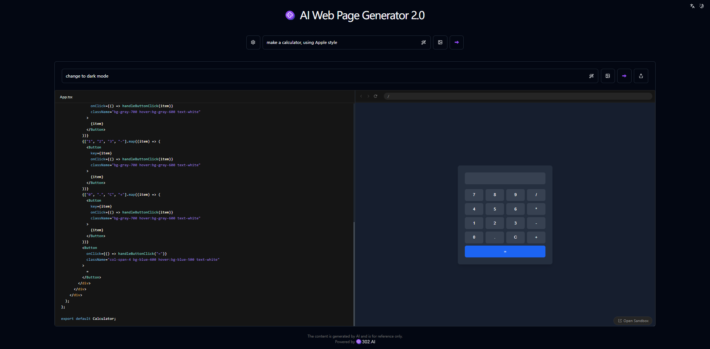

# 💻🤖 欢迎来到302.AI的AI网页生成器2.0! 🚀✨

[中文](README_zh.md) | [English](README.md) | [日本語](README_ja.md)

来自[302.AI](https://302.ai)的[AI网页生成器2.0](https://302.ai/tools/coder/)的开源版本。
你可以直接登录302.AI，零代码零配置使用在线版本。
或者对本项目根据自己的需求进行修改，传入302.AI的API KEY，自行部署。

## ✨ 302.AI介绍 ✨
[302.AI](https://302.ai)是一个按需付费的AI应用平台，为用户解决AI用于实践的最后一公里问题。
1. 🧠 集合了最新最全的AI能力和品牌，包括但不限于语言模型、图像模型、声音模型、视频模型。
2. 🚀 在基础模型上进行深度应用开发，我们开发真正的AI产品，而不是简单的对话机器人
3. 💰 零月费，所有功能按需付费，全面开放，做到真正的门槛低，上限高。
4. 🛠 功能强大的管理后台，面向团队和中小企业，一人管理，多人使用。
5. 🔗 所有AI能力均提供API接入，所有工具开源可自行定制（进行中）。
6. 💡 强大的开发团队，每周推出2-3个新应用，产品每日更新。有兴趣加入的开发者也欢迎联系我们

## 项目特性
1. 🤖 智能代码生成：根据您的需求自动生成代码。
2. ✍️ 灵活编辑：在生成过程中可以随时调整和修改代码内容。
3. 🎨 UI灵活选择：支持shadcn/ui组件库，快速打造美观界面。
4. 🌟 支持three.js，轻松实现3D可视化功能。
5. 🛠️ 提示词优化：对提示词进行优化，使AI生成的内容更精准。
6. 🖼️ 图像辅助：支持上传设计图，让AI根据图像生成对应代码。
7. 💬 多轮交互：支持持续对话，根据反馈不断调整代码生成。
8. 🔗 代码引用：可以引用生成的代码片段，并让AI进行相应修改。
9. 📤 便捷分享：轻松分享生成的代码，让更多人欣赏您的作品。
10. 🌙 贴心暗色：提供暗色模式，呵护您的用眼健康。
11. 🌐 全面国际化：支持中文、英文、日文界面切换。

通过AI代码生成器2.0,任何人都可以成为代码创作者! 🎉💻 让我们一起探索AI驱动的代码新世界吧! 🌟🚀

## 技术栈
- Next.js 14
- Tailwind CSS
- Shadcn UI
- Sandpack
- Vecel AI SDK

## 开发&部署
1. 克隆项目 `git clone https://github.com/302ai/302_web_page_generator`
2. 安装依赖 `pnpm install`
3. 配置302的API KEY 参考.env.example
4. 运行项目 `pnpm dev`
5. 打包部署 `docker build -t coder-generator . && docker run -p 3000:3000 coder-generator`

## 界面预览

